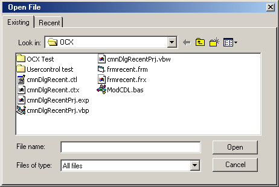



## CommonDialog with Recent File Tab

### Description

Adds a touch of professionalism to your project.

Just like VB IDE. One tab has the common dialog, the other tab

shows recent files, their path and their icon in a listview.

Can obviously be adapted to show images, provide different settings and options to the user as to how they wish to open a file.

Included : Standard EXE project, UserControl Project and test project,

OCX Project and a test project for the OCX.

Demonstrates saving/loading listview to registry, getting file icons for use in a listview, how to build your own commondialog controls,

controlling other apps windows.
 
### More Info
 

             |
---                |---
**Submitted On**   |2002-05-02 07:47:04
**By**             |[MrBobo](https://github.com/Planet-Source-Code/PSCIndex/blob/master/ByAuthor/mrbobo.md)
**Level**          |Intermediate
**User Rating**    |4.8 (67 globes from 14 users)
**Compatibility**  |VB 5\.0, VB 6\.0
**Category**       |[Files/ File Controls/ Input/ Output](https://github.com/Planet-Source-Code/PSCIndex/blob/master/ByCategory/files-file-controls-input-output__1-3.md)
**World**          |[Visual Basic](https://github.com/Planet-Source-Code/PSCIndex/blob/master/ByWorld/visual-basic.md)
**Archive File**   |[CommonDial78433522002\.zip](https://github.com/Planet-Source-Code/mrbobo-commondialog-with-recent-file-tab__1-34341/archive/master.zip)

